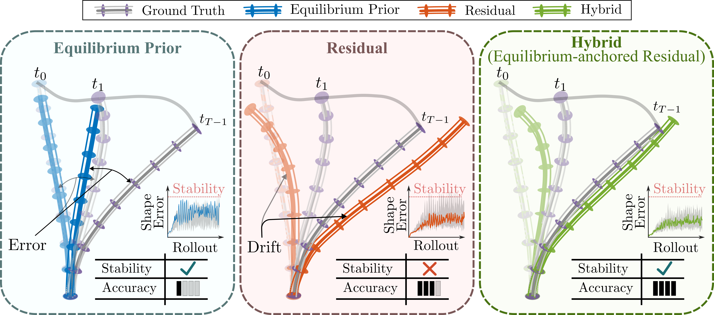

# Stabilizing 3D Continuum-Arm Rollouts via Equilibrium Anchoring and Feature-Lifted Residual Learning

**RSS 2026**

This project page provides videos, paper links, and code-release information for our RSS 2026 paper.

## Overview

We propose an equilibrium-anchored residual dynamics framework for stable multi-step prediction of soft and continuum robotic systems under actuation shift. The method separates steady-state anchoring from transient correction by learning an input-conditioned equilibrium reference from static data and a residual model from dynamic trajectories.

## Paper

**Paper PDF:** coming soon  

## Videos

**Supplementary video:** coming soon  

## Code

**Code:** A cleaned and documented implementation is being prepared for public release. A tagged release corresponding to the RSS 2026 camera-ready experiments will be linked here once finalized.

## Authors

Ahsan Tanveer, Rahdar Hussain Afridi, Waqar Hussain Afridi, Feitian Zhang, and Guangming Xie

## Citation

Citation will be updated after the official RSS proceedings metadata is available.
